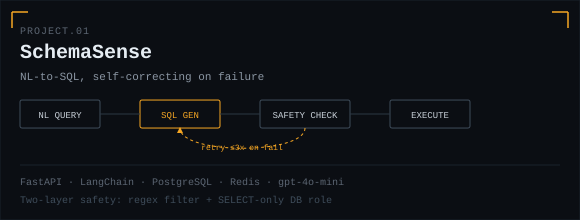
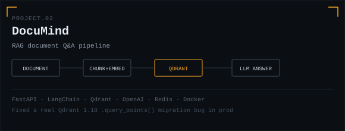
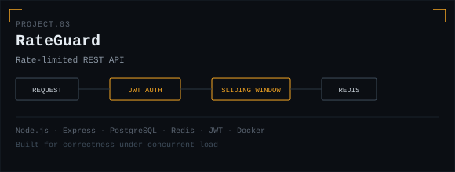
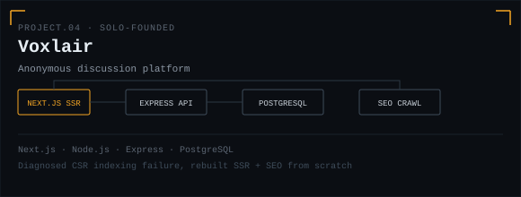
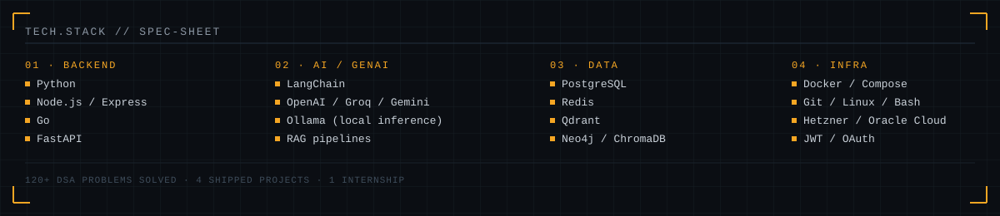

 

## Featured builds

<table>
<tr>
<td width="50%"></td>
<td width="50%"></td>
</tr>
<tr>
<td width="50%"></td>
<td width="50%"></td>
</tr>
</table>

## Stack

## Currently in the workshop

Not resume-polished yet, but where the real depth is being built:

- **Storage engine (Go)** — slotted pages, LRU buffer pool, B+ tree with full split/merge rebalancing, WAL with CRC32 crash recovery, benchmarked against BoltDB
- **Jenny** — a local-first AI agent with multi-LLM routing, three-layer TTS, and a Neo4j + ChromaDB + SQLite memory architecture
- **Ignix OS** — an Arch Linux-based desktop OS with a Hyprland/Sway compositor and Rust background services

## Live metrics

The one section that has to stay dynamic — can't hand-draw a commit count.

**[Portfolio](https://www.sakshamtiwari.net/)** · **[LinkedIn](https://www.linkedin.com/in/sakshamtiwarii)** · **[Email](mailto:tsaksham22@gmail.com)**

SYS.PROFILE // EOF

